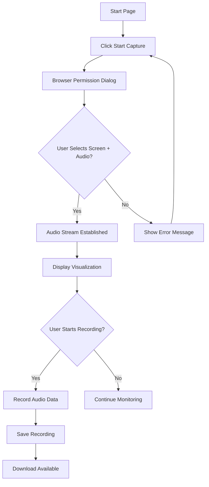

# Product Requirements Document

## 1. Product Overview

This is a technical prototype for evaluating browser-based Windows system audio capture capabilities. The prototype will demonstrate the feasibility of capturing system-wide audio through Chrome/Edge browsers for potential integration with enterprise translation services.

**Primary Purpose:** Validate that browser-based audio capture can successfully capture Teams video call audio for real-time translation processing.

**Target Users:** Enterprise technical teams evaluating audio capture solutions for internal communication tools.

**Market Value:** Enables real-time translation of enterprise video calls without requiring desktop application installation.

## 2. Core Features

### 2.1 User Roles

| Role | Registration Method | Core Permissions |
|------|-------------------|------------------|
| Technical Evaluator | No registration required | Access to audio capture and visualization |

### 2.2 Feature Module

Our audio capture prototype consists of the following main pages:

1. **Audio Capture Interface**: Screen sharing initiation, audio source selection, capture controls
2. **Audio Visualization Dashboard**: Real-time waveform display, frequency analysis, audio level indicators
3. **Recording Management**: Start/stop recording, save audio files, download captured audio

### 2.3 Page Details

| Page Name | Module Name | Feature description |
|-----------|-------------|---------------------|
| Audio Capture Interface | Screen Share Initiation | Display "Start Capture" button that triggers browser's screen sharing dialog with audio option enabled |
| Audio Capture Interface | Audio Source Selection | Guide user to select "Entire Screen" and check "Share Audio" checkbox for system audio capture |
| Audio Capture Interface | Capture Controls | Provide start/stop buttons for audio stream management with status indicators |
| Audio Visualization Dashboard | Real-time Waveform | Display live audio waveform using Web Audio API with 2048-sample buffer for smooth visualization |
| Audio Visualization Dashboard | Frequency Analysis | Show frequency spectrum bars (32-44kHz range) with 64 frequency bands |
| Audio Visualization Dashboard | Audio Level Indicators | Display current audio amplitude with visual level meter and peak detection |
| Recording Management | Recording Controls | Start/stop recording button with elapsed time counter and file size estimation |
| Recording Management | Audio File Management | Save recorded audio as WebM/Opus format and provide download link |
| Recording Management | Quality Settings | Allow selection of audio bitrate (128kbps default) and recording format |

## 3. Core Process

### User Flow for Audio Capture

1. **Initial Setup**: User navigates to prototype page and clicks "Start Audio Capture"
2. **Permission Request**: Browser displays screen sharing dialog with audio sharing option
3. **Source Selection**: User selects "Entire Screen" and checks "Share Audio" checkbox
4. **Audio Validation**: System verifies audio track availability and displays confirmation
5. **Visualization**: Real-time waveform and frequency analysis begin displaying
6. **Recording**: User can start/stop recording to save audio data
7. **Download**: Recorded audio file becomes available for download and analysis

## 4. User Interface Design

### 4.1 Design Style

**Primary Colors:**
- Primary: #2563eb (Blue) - Main actions and highlights
- Secondary: #10b981 (Green) - Success states and recording indicators
- Background: #f8fafc (Light gray) - Clean, minimal background
- Text: #1e293b (Dark gray) - High contrast text

**Button Style:**
- Rounded corners (8px radius)
- Clear hover states with 10% darker shade
- Large touch targets (48px minimum height)

**Typography:**
- Font: System UI stack (Inter, -apple-system, BlinkMacSystemFont)
- Headers: 18-24px, Medium weight (500)
- Body: 14-16px, Regular weight (400)

**Layout Style:**
- Card-based layout with subtle shadows
- Single-column design for focus
- Generous whitespace (16-24px spacing)

**Icon Style:**
- Simple line icons (Feather Icons or similar)
- Consistent 20px size for UI elements
- Green/red indicators for recording status

### 4.2 Page Design Overview

| Page Name | Module Name | UI Elements |
|-----------|-------------|-------------|
| Audio Capture Interface | Start Capture Section | Large blue button with microphone icon, brief instruction text explaining screen sharing requirement |
| Audio Capture Interface | Status Display | Card showing connection status, audio track availability, and current audio level meter |
| Audio Visualization Dashboard | Waveform Display | Canvas element showing real-time waveform with time axis and amplitude scaling |
| Audio Visualization Dashboard | Frequency Bars | Horizontal bar chart with 64 frequency bands, color-coded by frequency range |
| Audio Visualization Dashboard | Audio Metrics | Numeric display of current dB level, peak indicator, and audio duration |
| Recording Management | Recording Controls | Red circular record button, stop button, elapsed time display, file size indicator |
| Recording Management | File Management | Download button for saved recordings, recording history list with timestamps |

### 4.3 Responsiveness

**Desktop-First Design:**
- Optimized for 1920x1080 desktop displays
- Minimum width: 1024px for full functionality
- Fixed layout for consistent enterprise environment

**Browser Compatibility:**
- Chrome 74+ and Edge 79+ on Windows only
- No mobile support (mobile browsers lack system audio capture)
- Touch interaction not required (mouse/keyboard focused)

## 5. Technical Constraints

### 5.1 Browser Limitations

- **Audio Source**: Cannot capture specific application audio - must capture entire system
- **User Permission**: Requires explicit user consent and manual selection of screen + audio
- **Platform Restrictions**: Windows-only due to system audio capture requirements
- **Security**: Browser will display recording indicator during capture session

### 5.2 Audio Quality Requirements

- **Sample Rate**: 48kHz (standard for speech processing)
- **Bitrate**: 128kbps Opus encoding for optimal file size
- **Latency**: <100ms for real-time visualization
- **Format**: WebM container with Opus audio codec

### 5.3 Performance Requirements

- **CPU Usage**: <25% on modern dual-core processors
- **Memory**: <100MB for audio buffers and visualization
- **Network**: No external dependencies - fully client-side operation
- **Storage**: Temporary audio files cleared after download or page refresh